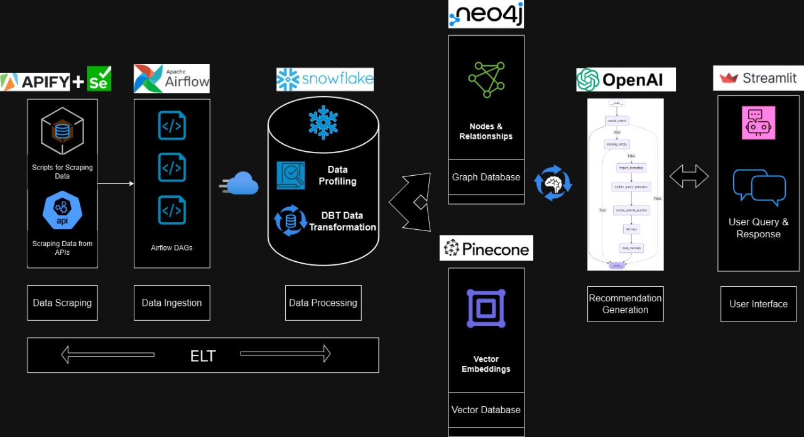

# TravelGenie - Intelligent Travel Recommendation System

## Overview
TravelGenie is a travel recommendation system that leverages data scraping, processing, and AI-based recommendations to provide personalized travel suggestions. The system integrates multiple technologies, including Apache Airflow, Snowflake, Neo4j, Pinecone, and OpenAI, to efficiently process and analyze travel-related data.

## Architecture
The system follows an **ELT (Extract, Load, Transform)** approach using Snowflake and consists of the following components:

1. **Data Scraping**  
   - Uses **APIFY + Selenium** to scrape travel-related data from APIs and websites.
   - Extracts details such as hotels, restaurants, attractions, and user reviews.

2. **Data Ingestion**  
   - Apache **Airflow DAGs** automate the extraction and loading of scraped data.
   - The ingested data is stored in **Snowflake**.

3. **Data Processing**  
   - Snowflake is used for **data profiling** and **DBT (Data Build Tool) transformations**.
   - Data is cleaned, enriched, and structured for analysis.

4. **Graph Database (Neo4j)**  
   - Stores relationships between users, locations, reviews, and recommendations.
   - Enables graph-based queries for travel insights.

5. **Vector Database (Pinecone)**  
   - Stores vector embeddings of travel-related data.
   - Used for **similarity search and personalized recommendations**.

6. **Recommendation Generation**  
   - **OpenAI** processes user queries and generates intelligent recommendations.
   - Utilizes an AI pipeline for structured query generation and response.

7. **User Interface**  
   - **Streamlit** provides an interactive UI for users to input queries and receive recommendations.

   
